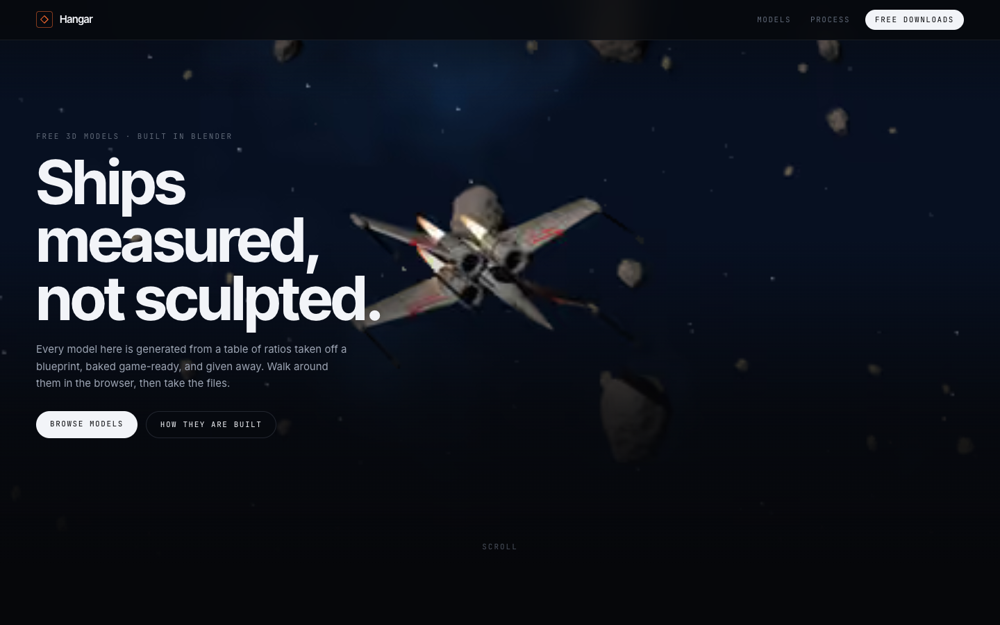

# Hangar

Free 3D models, built procedurally in Blender, with a scroll-driven cinematic
page per model that dissolves into a live WebGL inspector.

**Live site: https://hangar-bbv.pages.dev**

[](https://hangar-bbv.pages.dev)

Vite + React + TypeScript, three.js via react-three-fiber, Lenis for scroll,
Cloudflare Pages + Functions, D1 for the catalogue, R2 for source downloads.

## Run it

```bash
npm install
npm run dev          # site only, http://localhost:5174 — no API
```

The download API needs the Pages runtime with local D1 and R2:

```bash
npm run cf:migrate:local
node scripts/package-downloads.mjs --push local
npm run build && npm run dev:cf     # http://localhost:8788
```

## How the model pages work

Each live model page is **one pinned stage** driven by a single scroll timeline:

1. The Cycles flythrough is scrubbed by scroll position (a pre-rendered AVIF
   sequence, not WebGL — it will always beat a realtime render).
2. It holds on the final frame.
3. That frame dissolves into the live inspector underneath, whose camera opens
   on the **same angle and framing**, measured from that exact frame.

The framing is measured, not tuned by eye. `make-posters.mjs` finds how much of
the still's width the model occupies; `anchors.mjs` extracts silhouette points
from the exported geometry; the inspector projects those with perspective and
bisects for the camera distance that reproduces it. At a 50/50 blend the still
and the live model register with no visible ghosting.

The inspector mounts early and stays on `frameloop="demand"` while covered; the
still is held opaque until the model has actually drawn a frame, so the dissolve
can never reveal an empty stage. Pages without a live model never load three.js.

## Asset pipeline

Everything under `public/assets/` and every `src/lib/*.generated.ts` is built
from the Blender projects in `SOURCE_ROOT` (see `.env.example`). Re-run after a
re-export:

| Script | Does | Writes |
|---|---|---|
| `optimize-glb.mjs` | WebP textures, optional simplify + quantize per model; measures anchors, silhouette and centre | `public/assets/models/*.glb`, `anchors.generated.ts` |
| `build-sequence.mjs` | Frame sequence → desktop/mobile AVIF ladders | `public/assets/seq/` |
| `make-posters.mjs` | Renders → responsive AVIF; measures each seam still | `public/assets/posters/`, `plates.generated.ts` |
| `package-downloads.mjs` | Packs source scenes, zips textures, uploads with `--push` | `.downloads/`, `downloads.generated.ts`, R2, D1 |

Web assets (~9 MB) are committed because Pages builds from git and cannot see
`SOURCE_ROOT`. Source scenes and texture sets are not: they live in R2.

### Source scenes are sanitised before shipping

The baked `.blend` files reference textures by absolute path on the build
machine, which would open magenta for everyone else and leak the builder's home
directory. `scripts/blender/package_scene.py` makes paths relative, packs every
texture into the file, and writes only the scene data (no UI state, which
carries the file browser's home directory). `package-downloads.mjs` then
**refuses to ship** any file that still contains a `/Users/` path or has an
unpacked image.

## Deploy

1. `wrangler d1 create hangar` → put the id in `wrangler.toml`.
2. `wrangler r2 bucket create hangar-assets`.
3. `wrangler secret put SIGNING_KEY` — the value in `wrangler.toml` is dev-only.
4. `npm run cf:migrate:remote && node scripts/package-downloads.mjs --push remote`
5. Connect the repo to Cloudflare Pages: build `npm run build`, output `dist`.

## Adding a model

1. Add it to `MODELS` in `scripts/_shared.mjs` (paths into its Blender project,
   seam still and opening view, anchor rules in `scripts/anchors.mjs`).
2. Add its page copy and hotspots to `src/lib/catalog.ts`, and a row to a new
   migration.
3. Run the four pipeline scripts.

`creator_id` and `price_cents` are in the schema from the first migration, so
multi-creator and paid downloads are route additions, not migrations.
